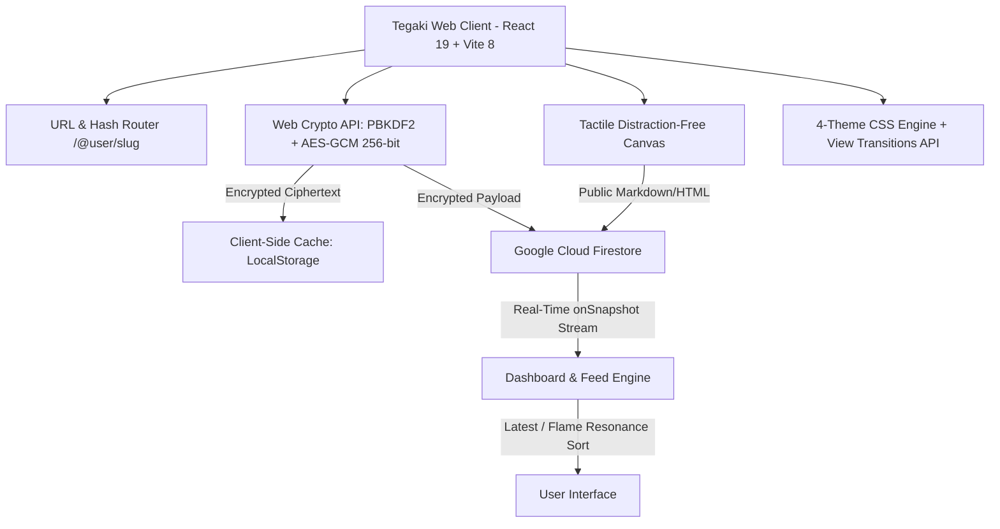
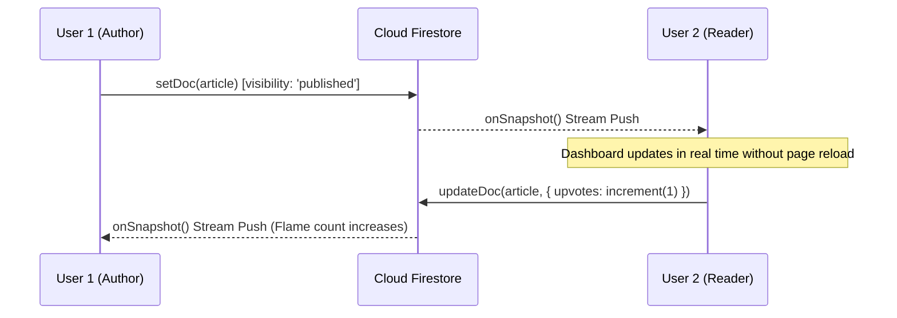

# Tegaki System Architecture & Engineering Design

This document details the architectural foundation, data lifecycle, encryption pipeline, and real-time synchronisation mechanics of **Tegaki (手書き)**.

---

## 1. High-Level System Architecture



---

## 2. Core Subsystems

### 2.1 The Two Spheres Data Model
Tegaki enforces a strict architectural boundary between private reflections and public publications:

| Dimension | The Solitary Notebook (`private`) | The Published Letter (`published`) |
| :--- | :--- | :--- |
| **Audience** | Author Eyes Only | Global Public Web |
| **Storage Security** | Client-Side AES-256-GCM Encrypted | Clean Sanitized HTML/Markdown |
| **Firestore Querying** | Restricted to `authorId == request.auth.uid` | Publicly indexable & readable |
| **Routing** | Private Desk Dashboard | Custom Author Slug (`/@username/slug`) |
| **Social Signals** | None (Zero metrics, zero follower counts) | Flame Resonance Claps & Margin Dialogue |

### 2.2 Client-Side Cryptography Pipeline
For private journal entries, encryption happens entirely in-memory on the client machine using native browser cryptography:

```
[Plaintext Draft]
       │
       ▼
[PBKDF2 Key Derivation] ──> Salt (16 bytes) + 100,000 iterations SHA-256
       │
       ▼
[AES-GCM 256-bit Encryption] ──> IV (12 bytes) + Ciphertext + Auth Tag
       │
       ▼
[Base64 Encrypted String] ──> Stored in Firestore / LocalStorage
```

- **Zero-Knowledge Guarantee**: Server infrastructure never receives or logs private encryption keys.
- **Decryption**: In-memory decryption occurs only when the authenticated author opens the editor or reader.

---

## 3. Real-Time Cloud Synchronization

Tegaki employs a real-time reactive sync architecture built on Firestore's `onSnapshot` listeners combined with atomic server increments:



### Key Synchronization Safeguards:
1. **Payload Sanitization (`cleanUndefined`)**: Eliminates JavaScript `undefined` properties before serialization to satisfy strict Firestore type contracts.
2. **Atomic Upvote Operations**: Uses `increment(1)` to avoid race conditions when multiple readers applaud simultaneously.
3. **Composite Indexing**: Deployed compound index on `collection('articles')` (`visibility ASC, createdAt DESC` and `visibility ASC, upvotes DESC`).

---

## 4. The 4-Theme Engine & View Transitions

Tegaki adheres to a strict design mandate: **Zero Gradients. Zero Shadows. 1px Hairline Theme-Matched Borders.**

- **DOM Theme Contract**: Injected via `data-theme` attribute on `:root`:
  - `white` — Pure high-contrast paper.
  - `off-white` — Eye-comfort parchment (`#FBF9F5`).
  - `dark-gray` — Refined editorial slate (`#242424`).
  - `amoled` — Pure midnight black (`#000000`).
- **Circle-Out Expansion Animation**: Built using the modern browser **View Transitions API** (`document.startViewTransition`) with dynamic click coordinates (`--theme-x`, `--theme-y`) and cubic-bezier easing (`cubic-bezier(0.16, 1, 0.3, 1)`).

---

## 5. Directory Layout

```
tegaki/
├── src/
│   ├── components/
│   │   ├── auth/           # Firebase Auth & WebAuthn modals
│   │   ├── common/         # Avatars, toast, themes, search bar, icons
│   │   ├── dashboard/      # Desk feed, filter tabs, article cards, sorting
│   │   ├── landing/        # Full-height interactive landing experience
│   │   ├── layout/         # Minimalist hairline sidebar
│   │   ├── reader/         # Publication reader, claps, comments drawer
│   │   └── writer/         # Distraction-free canvas, floating bubble, plus menu
│   ├── context/            # AuthContext, ArticlesContext, ThemeContext
│   ├── services/           # Firebase SDK, Firestore service, Crypto, Storage, Slugs
│   ├── styles/             # Tailwind CSS 4 & Strict Minimalist theme tokens
│   └── types/              # TypeScript definitions for Articles, Themes, Auth
├── firestore.rules         # Hardened production Firestore security rules
├── firestore.indexes.json  # Cloud Firestore composite indexes
└── firebase.json           # Firebase project manifest
```
